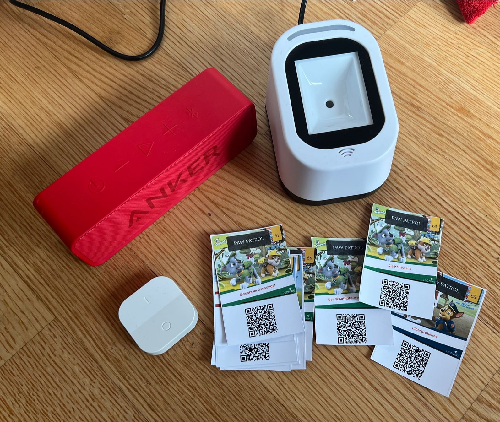

# hoerspieler, ein Hörspielautomat

- Raspberry Pi
- Speaker für den PI. Angeschlossen über Klinke oder USB oder Bluetooth. Unten ist beschreiben wie man Bluetooth-Speaker einrichtet. Wichtig ist nur, dass der Pi Audio ausgeben kann.
- QR-Code Reader
  - z.B. https://www.amazon.de/gp/product/B07RVJXHZC/ref=ppx_yo_dt_b_asin_title_o04_s00?ie=UTF8&psc=1
  - gibt es auch bei AliExpress
  - kann man sicher auch selbst besteln mit einer Webcam am Pi
- Karten mit QR-Codes für die Hörspiele. Ich nutze dafür Spotify. Siehe Unterordner `cards`



# base installation

z.B. mit Raspberry Pi Imager (Strg+Shift+X für Advanced Options) Raspberry Pi OS Lite (32-bit) installieren.

# bluetooth
```
sudo apt-get install vim bluetooth bluez pulseaudio-module-bluetooth mpg123

# add users to pulseaudiogroup
sudo usermod -a -G lp pi
sudo usermod -a -G lp root

sudo vim /etc/bluetooth/main.conf
    add:  Enable=Source,Sink,Headset
	
# restart pulse audio (als user pi)
pulseaudio --start

# pair
sudo bluetoothctl
  agent on 
  pairable on
  scan on

  pair A4:77:58:10:88:16 
  connect A4:77:58:10:88:16 
  trust A4:77:58:10:88:16 

# test
mpg123 foo.mp3
```

# mopidy 

Als Audioplayer kommt https://mopidy.com/ mit der Spotify-Extension zum Einsatz. Natürlich kann man die Inhalte auch lokal bereit stellen.

```
sudo wget -q -O - https://apt.mopidy.com/mopidy.gpg | apt-key add -
sudo wget -q -O /etc/apt/sources.list.d/mopidy.list https://apt.mopidy.com/buster.list
sudo apt update
sudo apt install mopidy mpc pip

sudo vim /etc/mopidy/mopidy.conf
    # siehe unten
    # dafür auth von https://mopidy.com/ext/spotify/ - neben client_id und _secret braucht es auch username und password!

sudo vim /etc/pulse/default.pa
    load-module module-native-protocol-tcp auth-ip-acl=127.0.0.1

pulseaudio -k
pulseaudio --start

sudo systemctl enable mopidy
sudo service mopidy start

sudo python3 -m pip install Mopidy-Iris
sudo python3 -m pip install Mopidy-MPD
sudo apt install mopidy-spotify
sudo service mopidy restart
```

 - http://host:6680/iris
 - Settings und Spotify auch hier aktivieren

## /etc/mopidy/mopidy.conf
```
[http]
enabled = true
hostname = 0.0.0.0
port = 6680
zeroconf = Mopidy HTTP server on $hostname
allowed_origins =
csrf_protection = true
default_app = mopidy

[file]s
enabled = true
media_dirs =
        /media

[spotify]
username = ***
password = ***
bitrate = 320

client_id = ***
client_secret = ***

[audio]
output = pulsesink server=127.0.0.1
```

# QR-Code Reader

https://www.amazon.de/gp/product/B07RVJXHZC/ref=ox_sc_act_title_1?smid=AF4AJ9IUXX2ZF&psc=1

Konfiguriert mit den Codes

- Add Enter
- Virtual Serial Port
- Low volumne

Dann ist er als `/dev/ttyACM0` zu finden

Folgendes Script kümmert sich um den Rest.

```
#!/bin/bash

while read -r line < /dev/ttyACM0; do
        echo $line
        mpc clear
        mpc add $line
        mpc play
done
```

# TODO

- Das QR-Code Reader Script als Startup oder Service laufen lassen
- Pulseaudio automatisch starten, falls es nicht vom mopidy aus gestartet wird `pulseaudio --start`
- Der Play-Pause-Button der Bluetooth-Lautsprecher funktioniert nicht. Das wäre toll, wenn es irgendwie bis zu mopidy geroutet werden kann.