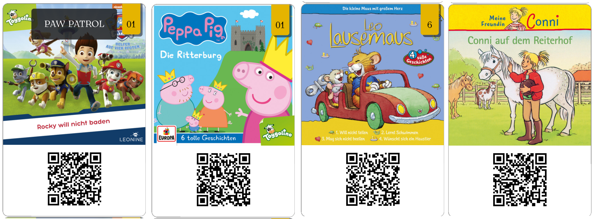

# Karten für den hoerspieler

Im QR-Code muss ein Link kodiert sein, der von mopidy als Playlist intepretiert werden kann.

Das F#-Script `spotify.fsx` nutzt die Spotify-API um Metadaten von Alben eines Interpreten zu sammeln, Cover herunterzuladen, QR-Codes zu erstellen und alles als LaTeX zu speichern. 

Das LaTeX Template stammt von https://tex.stackexchange.com/questions/47924/creating-playing-cards-using-tikz und ist leicht angepasst. 

Am Ende hat man ein PDF mit den Karten (10 Karten je A4 Seite). Am besten druckt man es auf dickem Papier (z.B. 250g/qm) aus.

# Beispiele

